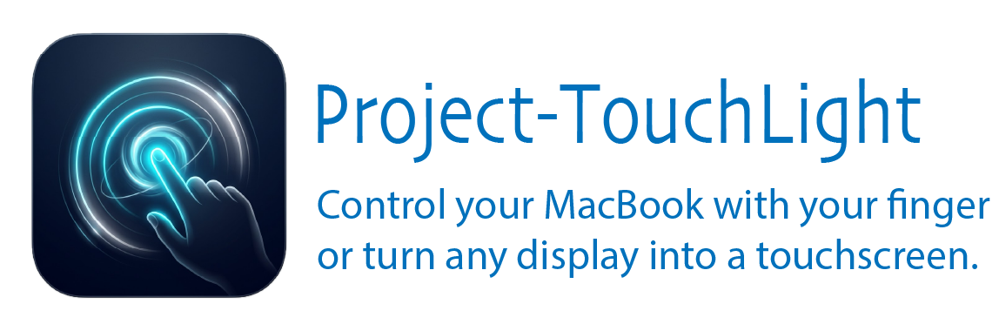
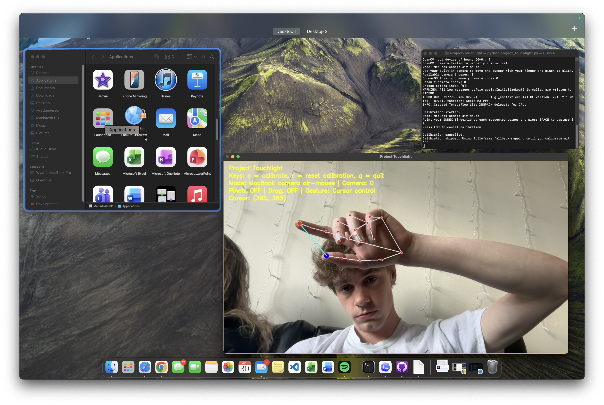

## Overview

Project Touchlight is a gesture-based control system that turns your camera into an
intuitive input device. Use hand gestures to control your Mac with precision and ease.

> **Beta status**: This project is currently in beta. Features and functionality may change.

## Features

- **Hand Gesture Recognition**: Uses MediaPipe for accurate hand landmark detection
- **Two Control Modes**:
  - **Continuity Camera Touchscreen**: Use your iPhone camera as a low-latency
    gesture-driven touchscreen
  - **MacBook Air-Mouse**: Use your built-in camera to move the cursor with your
    finger, pinch to click, and use trackpad-like gestures to switch desktops or
    open Mission Control.
- **Customizable Calibration**: Calibrate the gesture zone to your camera setup for optimal accuracy
- **Smooth Cursor Control**: Exponential moving average smoothing for fluid mouse movement

## Requirements

- Python 3.7+
- macOS system with camera access
- Accessibility permissions enabled for terminal/Python app

## Installation

1. Clone or download this project

2. Create a virtual environment (optional but recommended):
   ```bash
   python3 -m venv .venv
   source .venv/bin/activate
   ```

3. Install dependencies:
   ```bash
   pip install -r requirements.txt
   ```

4. Grant Accessibility permissions:
   - Go to **System Settings** -> **Privacy & Security** -> **Accessibility**
   - Add your terminal application or Python to the list

## Usage

Run the application:
```bash
python project_touchlight.py
```

You'll be prompted to select a control mode and camera index.

### Controls

While running:
- **`c`** - Run calibration (point your index finger at each corner when prompted)
- **`r`** - Delete saved calibration and recalibrate
- **`q`** - Quit the application

## Tips

- For Continuity Camera mode, USB connection is preferred for lower latency
- Calibration improves accuracy. Run it once after setup
- Ensure good lighting for optimal hand detection
- Keep your hand within the camera frame for consistent tracking

## Example


